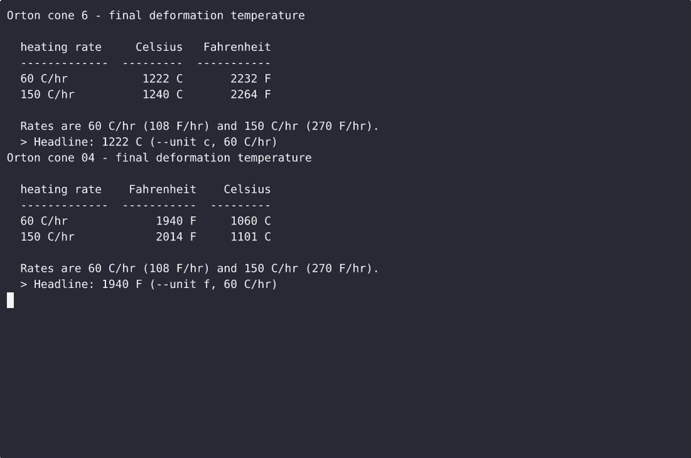
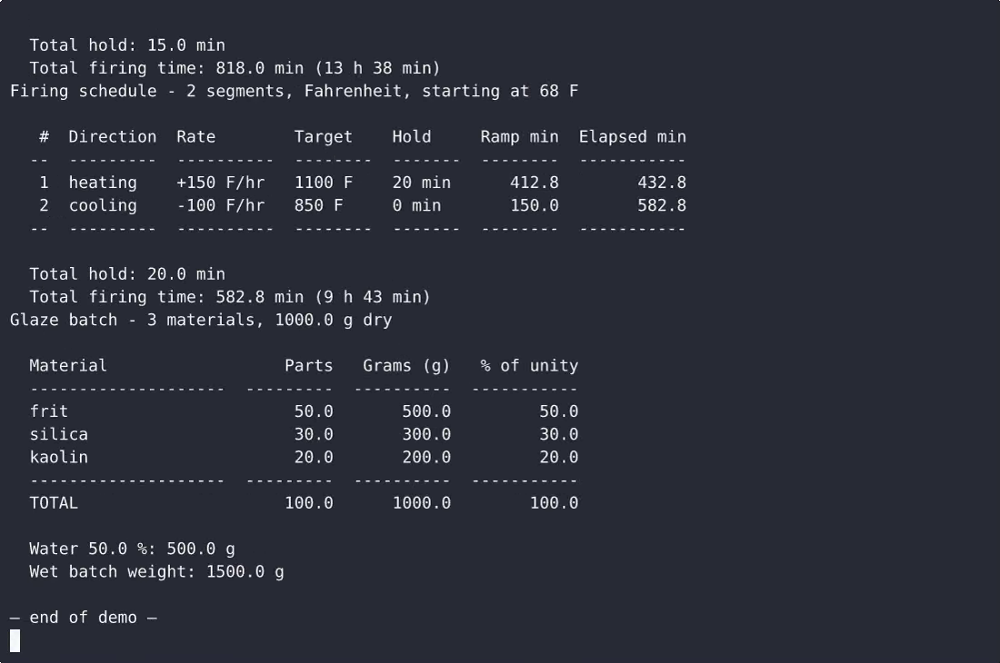

# Kilanvil — complete Full-stack app command-line tool example app

A Full-stack app command-line tool, open-source and ready to self-host: that's **Kilanvil**. Kilanvil is a single-file, standard-library-only Python command-line tool for potters: `kilanvil cone` looks up Orton large cone temperatures in °C and °F (single cone or the whole table), `kilanvil schedule` builds a…. Kilanvil ships complete — source, design assets, seed data — under the Apache-2.0 license; no cloud account needed. [Remix Kilanvil on cenius.ai](https://cenius.ai/marketplace/p/kilanvil?ref=gh&utm_campaign=kilanvil-webapp) for a custom build.


[](LICENSE)  [](https://cenius.ai)

[](https://cenius.ai/marketplace/p/kilanvil?ref=gh&utm_campaign=kilanvil-webapp)

> **▶ [Open & edit in cenius.ai](https://cenius.ai/marketplace/p/kilanvil?ref=gh&utm_campaign=kilanvil-webapp)** — one click to an editable workspace: describe changes in plain English, get an instant preview, one-click deploy and host. Modifications made on the platform come with full rebrand & relicense rights.

_Local clone? See [Quick start](#quick-start) below. cenius.ai is the zero-setup path._

## Demo


📽 **[Watch the walkthrough](https://cenius.ai/marketplace/p/kilanvil?ref=gh&utm_campaign=kilanvil-webapp)** — plays on cenius.ai · [MP4 file](.github/media/demo.mp4)

## Screenshots

 

## Features

- Cone temperature lookup
- Kiln firing schedule builder
- Glaze batch calculator

## Quick start

```bash
./install.sh   # installs dependencies + seeds demo data
```

See [`INSTALL.md`](INSTALL.md) for full setup and usage instructions.

## Architecture

`install.sh` takes care of packages and initial data in a single pass; nothing else is required before launching. The Full-stack app codebase (11 files) is self-contained — no external services needed to evaluate it. For environment-specific setup, see [`INSTALL.md`](INSTALL.md).

## Usage guide

Every example below is copy-pasteable and uses the documented invocation
`python3 kilanvil.py <subcommand> ...`. Results go to stdout, diagnostics go to
stderr, and the process exits `0` on success or `2` on a usage/validation error.

### Workflow 1: check a cone before you load the kiln

A glaze firing to cone 6 is a different temperature at a slow ramp than at a
fast one, so read both columns:

```bash
python3 kilanvil.py cone 6
```

```
  heating rate     Celsius   Fahrenheit
  -------------  ---------  -----------
  60 C/hr           1222 C       2232 F
  150 C/hr          1240 C       2264 F
```

If your kiln controller is set in Fahrenheit, ask for the Fahrenheit headline:

```bash
python3 kilanvil.py cone 6 --unit f
```

```
  > Headline: 2232 F (--unit f, 60 C/hr)
```

The `> Headline` line is the single highlighted reading: one unit, one rate, no
guessing which number the answer is.

Bisque firings are usually written in the single digits with a leading zero, and
Kilanvil never strips it - `04` is 1060 C, `4` is 1186 C:

```bash
python3 kilanvil.py cone 04 | head -3
python3 kilanvil.py cone 4  | head -3
```

Do not remember the number? Print the whole table and pick from it:

```bash
python3 kilanvil.py cone --list
python3 kilanvil.py cone --list | grep -E '^  (06|04|6|10) '
```

A cone that is not in the shipped set gets the nearest valid labels instead of a
bare failure:

```bash
$ python3 kilanvil.py cone 99
kilanvil: unknown cone '99' - not in the shipped 022-14 table; nearest shipped
          cones: 14, 13, 12
$ echo $?
2
```

_Full guide: [`USAGE.md`](USAGE.md)_

## FAQ

### How do I self-host Kilanvil?

Clone this repository and run `./install.sh`, then start the app as described in [`INSTALL.md`](INSTALL.md). Kilanvil is fully self-hostable — no external services are required to try it.

### How do I make Kilanvil my own brand?

Absolutely. [Open it on cenius.ai](https://cenius.ai/marketplace/p/kilanvil?ref=gh&utm_campaign=kilanvil-webapp) and remix it there — platform modifications come with full rebrand and relicense rights over your derivative, so the result is entirely yours.

### Does the Kilanvil license allow commercial use?

Yes — it ships under the Apache-2.0 license, which permits commercial use, modification and redistribution. The full text is in [LICENSE](LICENSE).

### What technologies are in Kilanvil's stack?

Full-stack app. The full source in this repository is exactly what the app runs. Highlights include glaze batch calculator.

### Is Kilanvil editable without a developer?

Yes — [load it on cenius.ai](https://cenius.ai/marketplace/p/kilanvil?ref=gh&utm_campaign=kilanvil-webapp), describe the change in plain English, and you get back a fresh build with your modification applied.

## License & rebranding

Released under the [Apache License 2.0](LICENSE) (© 2026 Cenius AI) — free for personal and commercial use. The Cenius name/logo are trademarks (see NOTICE).

**Need a customized version?** [Remix this app on cenius.ai](https://cenius.ai/marketplace/p/kilanvil?ref=gh&utm_campaign=kilanvil-webapp) — modifications made on the platform come with **full rebrand & relicense rights** over your derivative.

## Built with cenius.ai

This entire application — code, design, seeded demo data — was generated on **[cenius.ai](https://cenius.ai)** from a plain-English description.

- 🚀 [Build your own app on cenius.ai](https://cenius.ai)
- 🎛️ [Remix Kilanvil on the marketplace](https://cenius.ai/marketplace/p/kilanvil?ref=gh&utm_campaign=kilanvil-webapp) — open it in a workspace, prompt for changes, and ship your own version.

More open-source apps: [the Cenius-ai catalog](https://github.com/Cenius-ai) · [showcase index](https://github.com/Cenius-ai/showcase)
